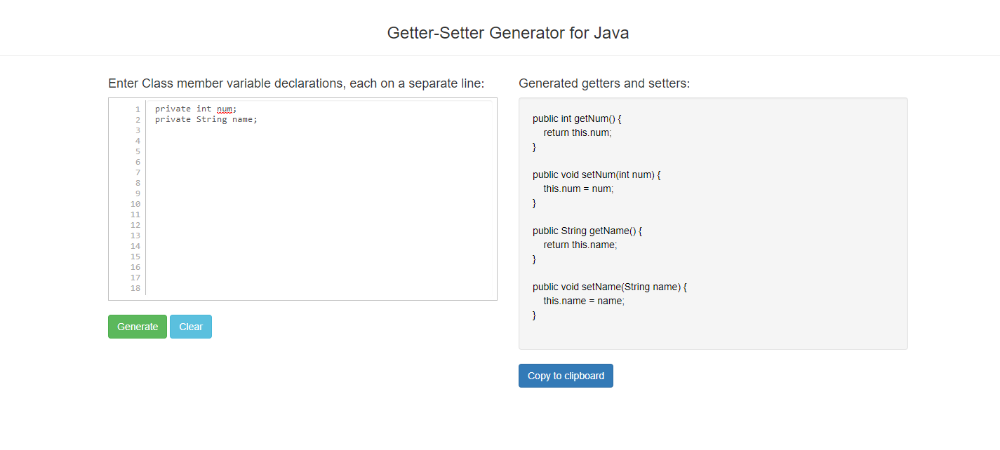

# Getter-Setter methods generator for Java

Version 1 of this utility is available at - [**v1**](./v1)
* Takes a class's member variable declarations, each on separate line.
* Generates getter and setter methods for each input line.

